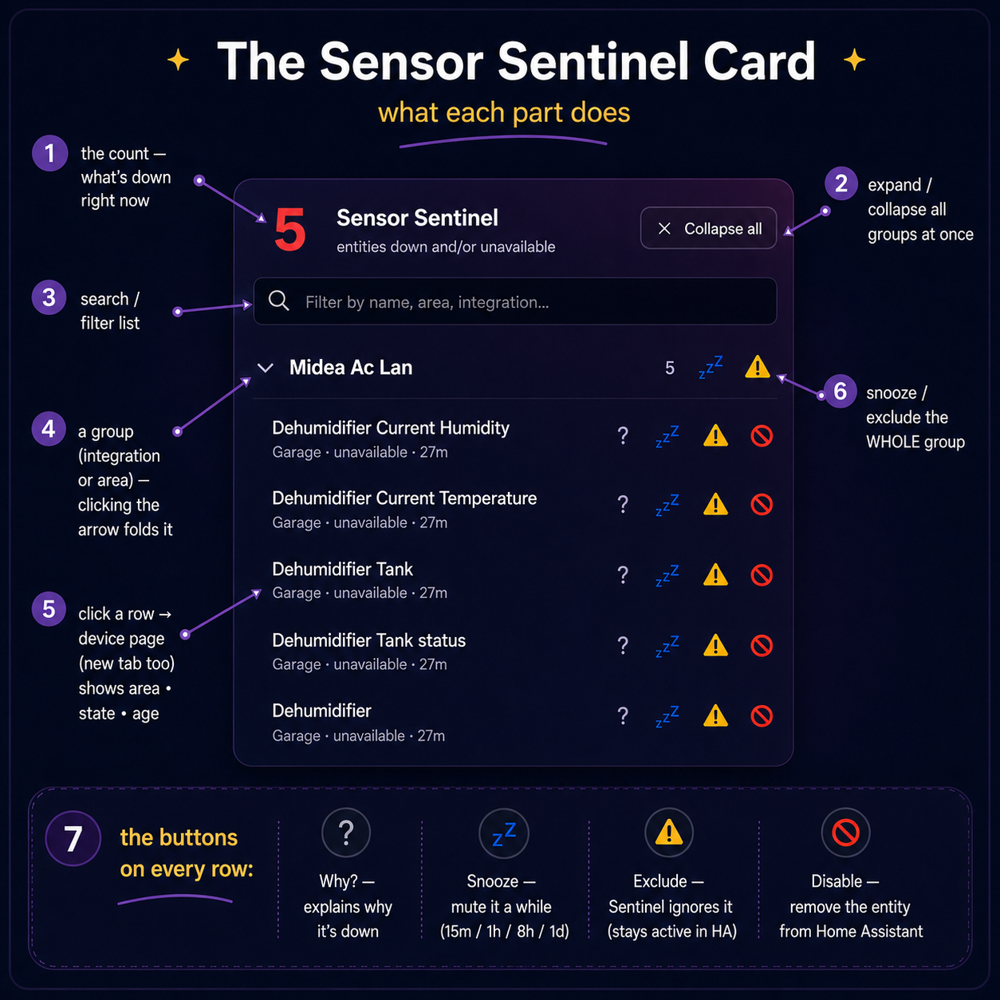

# Sensor Sentinel

A **performance-safe, event-driven watchdog** for Home Assistant that answers
one question well: **"what's unavailable right now, and why?"** — across your
whole fleet, without ever rescanning every entity on every state change.

> **Built to stay invisible.** Most "unavailable entities" helpers rescan every
> entity on every state change, which can bog Home Assistant down on a large
> setup. Sensor Sentinel tracks changes incrementally — one scan at startup,
> then near-zero work per event — so it stays light even across thousands of
> entities.

It ships with a companion Lovelace card, so once it's installed you get a live,
grouped, actionable list of everything that's down — with one-click snooze,
exclude, disable, and Z-Wave ping.



---

## Contents

- [Why a custom integration](#why-a-custom-integration)
- [Features](#features)
- [Install](#install)
- [Using the card](#using-the-card)
- [Configuration](#configuration)
- [Entities](#entities)
- [Events](#events)
- [Services](#services)
- [How it stays fast](#how-it-stays-fast)
- [Good to know](#good-to-know)
- [Troubleshooting the card](#troubleshooting-the-card)
- [License](#license)

---

## Why a custom integration

A template sensor can only poll or scan-per-event — neither is acceptable at
several thousand entities. An add-on can't cleanly reach the entity/device
registry. A custom integration listens on the event bus, keeps an incremental
set, enriches from cached registry maps, and exposes clean entities, events, and
services.

## Features

### Detection

- **Incremental** — a single bus listener maintains the down-set. No fleet-wide
  scan on any event; sensor attribute payloads are hard-capped.
- **Grace window** — a per-entity debounce (default 60s) suppresses flaps: an
  entity must stay bad past the window before it counts as an incident.
- **Startup warmup** — entities already bad at boot are held for a warmup window
  (default 120s) before counting, so transient boot-time unknowns (MQTT retained
  values, Z-Wave interviews, device trackers) don't spike the count.
- **Durable** — incident start-times and snoozes persist across restarts, so
  durations and the trend sparkline survive a reboot.

### Exclusions

- **Rules, not lists** — exclude by **domain**, **integration**, **entity_id
  glob** (e.g. `*_firmware`), or **explicit entity**, all from the UI. No
  hand-edited YAML.
- **Dry-run preview** — before saving a rule change, see exactly which
  currently-down entities it would silence, so you never over-exclude blindly.
- **Disabled entities are ignored** — an entity disabled in the registry is
  dropped immediately, even if it lingers in the state machine until its
  integration reloads.

### Notifications

- **Grouped & debounced** — a burst of drops becomes one message, rolled up by
  integration, plus recovery notices. Sent to your mobile app and/or as a
  persistent notification.
- **Re-alert** (opt-in) — optionally re-notify when something is *still* down
  after N hours.

### Self-healing & housekeeping (opt-in, off by default)

- **Auto-recovery** — try to heal a stuck entity: ping Z-Wave nodes, or reload
  the owning integration, with attempt caps and cooldowns.
- **Stale-retire** — automatically drop long-dead incidents (retired devices)
  from the count after N days; they stay visible, flagged, in the card.

### Companion Lovelace card

Bundled and auto-registered — no separate install or resource setup — with a
**visual editor** (no YAML). It shows the **full** live incident list (fetched
on demand via a websocket command, so the sensor attribute stays capped no
matter how many entities are down). See [Using the card](#using-the-card).

### Automation surface

`sensor_sentinel.entity_down` / `entity_recovered` / `entity_still_down` bus
events carry full context for your own automations. See [Events](#events).

## Install

1. **HACS → ⋮ → Custom repositories** → add this repo, category **Integration**.
2. Install **Sensor Sentinel**, then **restart Home Assistant**.
3. **Settings → Devices & Services → Add Integration → Sensor Sentinel**.
4. Add the card to a dashboard: **Add Card → Custom: Sensor Sentinel Card**.

## Using the card

Incidents are grouped (by integration or area) and sorted (by count or name).
Each group and the header have controls ([see the annotated card
above](#sensor-sentinel)):

**Header**

- **Count** — number of entities currently down.
- **Expand all / Collapse all** — toggle every group at once (state is
  remembered per dashboard).
- **Search** — filter the list by name, area, or integration.
- **Trend sparkline** *(optional)* — the down-count over the last N hours, from
  recorder history.

**Each incident row** — click the row to open the entity's **device page** (a
real link, so right-click / cmd-click / middle-click open it in a new tab), plus
action buttons:

| Button | Action |
| --- | --- |
| **?** | **Why?** — a dialog explaining the entity's status (down since, current state, matched exclusion rule, …). |
| **📡** | **Ping** the Z-Wave node (`zwave_js.ping`) to wake it — shown on Z-Wave rows only. |
| **💤** | **Snooze** — mute the entity for a preset (15m / 1h / 8h / 1d). |
| **⚠️** | **Exclude** — add a Sentinel rule so it's never reported. Stays active in HA; undo in **Configure**. |
| **🚫** | **Disable** — disable the entity in Home Assistant entirely (removed until you re-enable it in Settings → Entities). |

Group headers offer **snooze-all** and **exclude-all** for everything in the
group, plus — for integration groups — a **reload** button that reloads that
integration (often the quickest fix when a whole integration has gone dark).
Snooze, exclude, disable, and reload all open a confirmation dialog first.

**Card options** (visual editor): count entity, group by *integration/area*,
sort by *count/name*, collapse groups by default, show the Z-Wave ping button,
show the per-group reload button, and the trend sparkline window in hours
(0 = off).

## Configuration

Everything lives in the integration's **Configure** dialog. Each field has
inline help text.

| Setting | Default | What it does |
| --- | --- | --- |
| **Bad states** | `unavailable`, `unknown` | Which states count as "down". |
| **Excluded domains** | `button, event, group, image, input_button, input_text, remote, scene, stt, tts` | Whole domains to never report (where `unknown` is normal). |
| **Excluded integrations** | — | Whole integrations to never report. Picked from what's present in your system. |
| **Excluded entity_id globs** | — | Patterns like `*_firmware`, `roborock_*`. |
| **Excluded entities** | — | Specific entities to never report. |
| **Grace window** | 60s | How long an entity must stay bad before it's reported. |
| **Startup warmup** | 120s | Hold boot-time bad entities before counting them. |
| **Integration rollup threshold** | 5 | Collapse a burst from one integration into a single rolled-up incident. |
| **Re-alert if still down after** | 0 (off) | Re-notify after this many hours. |
| **Auto-retire incidents after** | 0 (off) | Drop incidents down longer than this many days. |
| **Automatic recovery** | off | Try to heal stuck entities (ping / reload) with guardrails. |
| **Recovery delay** | 300s | How long down before the first recovery attempt. |
| **Notification targets** | — | `notify.*` service names (without the `notify.` prefix). |
| **Persistent notifications** | on | Also create in-HA persistent notifications. |

## Entities

| Entity | Purpose |
| --- | --- |
| `sensor.sentinel_unavailable_count` | Live down-count. Attributes: `by_integration`, `by_area`, a capped 25-row sample, `recovered_today`, `longest_down`, `stale_count`. |
| `binary_sensor.sentinel_problem` | `device_class: problem` — on when anything is down. |
| `sensor.sentinel_recovered_today` | Entities recovered so far today (resets at local midnight). |
| `sensor.sentinel_longest_down` | Name of the entity down the longest; `entity_id` / `since` in attributes. |

## Events

| Event | Data |
| --- | --- |
| `sensor_sentinel.entity_down` | `entity_id, state, name, integration, device, area, since, flapping, stale` |
| `sensor_sentinel.entity_recovered` | `entity_id, name` |
| `sensor_sentinel.entity_still_down` | incident fields + `down_seconds` (fired by the opt-in re-alert) |

## Services

| Service | Description |
| --- | --- |
| `sensor_sentinel.snooze` | Mute an entity for N minutes. |
| `sensor_sentinel.unsnooze` | Clear a snooze. |
| `sensor_sentinel.exclude` | Add a permanent explicit-entity exclusion. |
| `sensor_sentinel.explain` | Return why an entity is flagged / excluded (service response). |

## How it stays fast

- One `hass.states` scan at startup to seed the set; never again.
- Per event: a state-set membership test and, at most, an O(rules) exclusion
  check — and only for entities that are bad or already tracked.
- Registry enrichment (name / device / area) happens per *incident* (post-grace),
  not per event, off cached registry maps refreshed only on registry updates.
- Sensor writes are coalesced (≤1/sec) so a flapping storm can't thrash Core.
- The full incident list is served on demand over a websocket command, so the
  sensor's attribute payload never grows unbounded.

## Good to know

- **Exclude vs. Disable** — *Exclude* only tells Sentinel to ignore an entity;
  it stays fully active in HA. *Disable* removes the entity from Home Assistant
  entirely (re-enable it in Settings → Entities). Use exclude for noise, disable
  for entities you truly don't want.
- **Just disabled something and it's still listed?** Disabling an entity leaves
  it in the state machine as `unavailable` until its integration reloads (e.g.
  Z-Wave JS). Sentinel drops disabled entities on sight, and a reload/restart
  clears them from HA for good.
- **Count looks high right after a restart?** That's the startup warmup settling
  — boot-time transients clear within the warmup window.

## Troubleshooting the card

The card is served by the integration itself at
`/sensor_sentinel/sensor-sentinel-card.js?v=<version>` and auto-loaded on every
dashboard (via the frontend's extra-module mechanism, not the Lovelace
resources list — so you won't see it under **Settings → Dashboards →
Resources**; that's normal).

If a dashboard shows a red **"Configuration error"** where the card should be:

1. **Hard-refresh the browser / clear the frontend cache.** On the HA mobile
   app: **Settings → Companion app → Debugging → Reset frontend cache**. Stale
   cached copies are by far the most common cause.
2. **Verify the module is being served.** Open
   `http://<your-ha>:8123/sensor_sentinel/sensor-sentinel-card.js` — you should
   get JavaScript, not a 404. A 404 means the integration didn't finish loading;
   check **Settings → System → Logs** for `sensor_sentinel` errors.
3. **Check the card's own error log.** The card records render failures to the
   browser's localStorage (they don't appear in HA's backend logs). In the
   browser console on the affected device, run:

   ```js
   JSON.parse(localStorage.getItem("sensor-sentinel-error-log") || "[]")
   ```

   and include the output when filing an issue.
4. **Manual fallback registration.** If a device stubbornly refuses to load the
   module automatically, add it explicitly under **Settings → Dashboards → ⋮ →
   Resources → Add resource** with URL
   `/sensor_sentinel/sensor-sentinel-card.js` and type **JavaScript module**.
   (Harmless alongside the auto-registration — the card guards against being
   defined twice.)

## Status

Actively developed. Auto-recovery, re-alert, and stale-retire are **opt-in** and
conservative (off by default), so the integration never acts on your system
unless you ask it to.

## License

MIT
